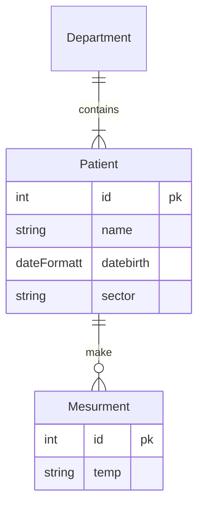

# D4.7. Итоговый проект


Проект News Portal

Пришла пора применить новые знания для улучшения вашего сайта с новостями.

## Фильтры и пагинация

1. Добавьте постраничный вывод на /news/, чтобы на одной странице было не больше 10 новостей и видны номера лишь ближайших страниц, а также возможность перехода к первой или последней странице.
2. Добавьте страницу /news/search. На ней должна быть реализована возможность искать новости по определённым критериям. Критерии должны быть следующие:

   - по названию;
   - по категории;
   - позже указываемой даты.

3. Убедитесь, что можно выполнить фильтрацию сразу по нескольким критериям.

   Для вывода поля фильтрации по датам вам может понадобиться указать специальный тип в HTML.

   Сложность в том, что форма за нас генерируется с помощью django-filter. Нам нужно сообщить ей о том, что мы хотим видеть на сайте календарь для выбора даты и времени. Браузер сможет отобразить автоматически сам интерфейс календаря (от нас не требуется его верстать). Для решения задачи правильного вывода формы нам поможет более сложная настройка класса с описанием фильтров.

   Вам необходимо изучить информацию по следующим ссылкам и постараться реализовать выбор даты:
   - [Посмотрите](https://django-filter.readthedocs.io/en/stable/guide/usage.html#the-filter), как указан фильтр name.
   - Вам потребуется дополнительно указать правильный тип поля формы в атрибуте widget. Пример можно посмотреть по [ссылке](https://django-filter.readthedocs.io/en/stable/ref/widgets.html).

Предположим, что в модели товаров, которую мы используем в модулях, есть поле added_at — время добавления товара на сайт:

```python
class Product(models.Model):
    name = models.CharField(
        max_length=50,
        unique=True,
    )
    ...
    added_at = models.DateTimeField(
        auto_now=True,
    )
```

И от нас требуется разместить на сайте фильтр по дате и времени добавления товара. Решить данную задачу мы можем следующим образом, доработав класс фильтров:
```python
from django_filters import FilterSet, DateTimeFilter
from django.forms import DateTimeInput
from .models import Product


class ProductFilter(FilterSet):
    added_after = DateTimeFilter(
        field_name='added_at',
        lookup_expr='gt',
        widget=DateTimeInput(
            format='%Y-%m-%dT%H:%M',
            attrs={'type': 'datetime-local'},
        ),
    )

    class Meta:
        model = Product
        fields = {
            'name': ['icontains'],
        }
```
Сразу отметим, что это не единственный вариант решения данной задачи, а просто один из возможных. Другим вариантом было бы указание более сложной конфигурации фильтра по дате в классе Meta.

Однако давайте разберём код варианта, приведённого выше.

Мы создали фильтр с названием added_after. В его аргументах указали следующее:

- фильтрация будет происходить по полю модели added_at;
- должен применяться фильтр «больше, чем переданное значение»;
- при генерации HTML-формы требуется использовать специальный виджет.

Виджетом в Django называются специальные классы, которые содержат шаблон (template) вывода данного поля. В аргументе format виджета мы указываем именно тот формат, который будет присылать нам браузер. В attrs передаём тип, который должен быть использован при генерации HTML — datatime-local. Данный тип был указан выше в задании.

## Создание, редактирование и удаление объектов

1. Запрограммируйте страницы создания, редактирования и удаления новостей и статей. Предлагаем вам расположить страницы по следующим ссылкам:

        /news/create/
        /news/<int:pk>/edit/
        /news/<int:pk>/delete/
        /articles/create/
        /articles/<int:pk>/edit/
        /articles/<int:pk>/delete/

   Если вы немного запутались, ввиду того, что модель у нас одна, а страницы под создание статей и новостей должны быть отдельно, то прочитайте подсказку.

   При этом не бойтесь сначала поискать информацию в интернете и пробовать разные подходы к решению задачи!

В модели вашего домашнего проекта есть поле, которое может принимать два значения — «статья» или «новость». Это поле пользователь заполнять не должен. В зависимости от того, на какой из страниц отправляется POST-запрос на сохранение данных, такой тип и должен проставляться в рассматриваемое нами поле. Запрос со страницы /news/create/ должен создать запись в базе полем, заполненным значением «новость», а /articles/create/ — с полем «статья». При этом выбор значения поля не должен быть доступен пользователю на сайте. Для решения этой задачи мы сами можем установить нужное значение поля перед сохранением инстанса модели.

В этом нам помогут методы form_valid у CreateView и save у ModelForm.

По этой [ссылке](https://docs.djangoproject.com/en/4.0/ref/class-based-views/generic-editing/#formview) вы можете посмотреть пример работы с form_valid, который вызывается при POST-запросах.

Метод save имеет единственный аргумент commit, который позволит нам получить инстанс модели без сохранения в базу. [Документация](https://docs.djangoproject.com/en/4.0/topics/forms/modelforms/#the-save-method) по теме.

Скомбинировав их, мы можем получить следующее решение: переопределяем form_valid в нашем дженерике, получаем инстанс модели без сохранения в базе, устанавливаем нужное значение поля с типом поста, сохраняем данные (вызвав form_valid у родительского класса).

Разберём на примере другой задачи. Предположим, что мы хотим создавать товары, устанавливая их количество в 13, и при этом не давать пользователю менять это значение.

Из формы убираем поле, которое отвечает за количество товара — quantity.
```python
class ProductForm(forms.ModelForm):
    class Meta:
        model = Product
        fields = ['name', 'description', 'category', 'price']
```

В представлении, которое наследует CreateView, переопределяем метод form_valid и устанавливаем поле модели quantity равным 13. Далее super().form_valid(form) запустит стандартный механизм сохранения, который вызовет form.save(commit=True).

```python
class ProductCreate(CreateView):
    form_class = ProductForm
    model = Product
    template_name = 'product_edit.html'

    def form_valid(self, form):
        product = form.save(commit=False)
        product.quantity = 13
        return super().form_valid(form)
```

Таким образом мы убрали из формы пользователя поле quantity и стали заполнять его в нашем представлении (view).

В задании требуется сделать две отдельные формы и два представления. Первая форма с представлением будет создавать новость, а вторая форма с представлением — статью. Указание типа создаваемого объекта будет находиться в представлении, так же как и указание количества товара в примере выше.


